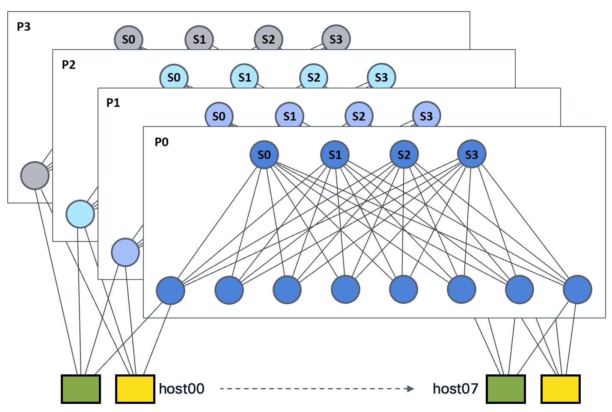

# Multipath Reliable Connection (MRC)

A deep dive into the MRC protocol — how it extends RoCEv2 with per-packet spraying, selective retransmission, and lossy Ethernet operation to scale RDMA for AI training fabrics — plus a hands-on emulator to see it in action.

## Background

RDMA (Remote Direct Memory Access) lets one machine read from or write to another machine's memory over the network without involving either CPU, making it extremely fast. **RoCEv2** (RDMA over Converged Ethernet v2) is the standard way to carry RDMA traffic over Ethernet, and it is the transport that AI training frameworks rely on to move data between GPUs.

RoCEv2 was designed for small-scale, lossless fabrics — and AI training breaks every one of those assumptions. As clusters scale to thousands of GPUs, a chain of problems emerges:

1. **Lossless Ethernet breaks down** — RoCEv2 relies on Priority Flow Control (PFC) to prevent packet drops. PFC works by sending a "pause" frame upstream whenever a switch buffer fills up, temporarily stopping the sender. At scale, these pause signals cascade across the fabric: one congested port can stall traffic on unrelated ports and switches — a problem called *head-of-line blocking*.

2. **Load balancing fails** — ECMP (Equal-Cost Multi-Path) routing hashes each connection to a single path so that packets arrive in order. This works well when thousands of small flows spread naturally across the fabric. However, AI training produces a handful of massive, long-lived flows called *elephant flows* — and when two of them hash to the same link, that link saturates while neighboring links sit idle.

3. **Out-of-order delivery crashes throughput** — Spreading traffic across multiple paths would solve the load-balancing problem, but it causes packets to arrive out of order. Standard RoCEv2 treats any out-of-order packet as lost, which triggers *Go-Back-N* retransmission — the sender resends everything from the assumed-lost packet onward, including packets that arrived correctly.

4. **Retransmission is expensive** — On a lossy fabric (one without PFC), packets occasionally get dropped. With Go-Back-N, every single drop triggers retransmission of the entire remaining stream, not just the missing packet.

5. **Congestion control cannot steer** — Existing congestion-control schemes can only slow the sender down globally; they cannot redirect traffic away from a congested path toward a healthy one.

6. **Failure recovery is slow** — A link failure waits for routing-protocol reconvergence (seconds), stalling or crashing the training job.

MRC addresses all six problems with one core change: replacing per-connection path pinning with **per-packet path selection**. Each packet is assigned a different **Entropy Value (EV)** — a label that maps to a specific physical path through the fabric. The sender continuously monitors every path using lightweight probes and shifts traffic away from unhealthy paths in microseconds.

PFC is disabled entirely: packet losses are handled through **trimming** (switches truncate and forward congested packets as loss notifications) and **selective retransmission** (only the missing packets are resent) instead of relying on a lossless fabric.

> For the full deep dive, see [**MRC Primer**](docs/MRC_Primer.md).

## Key Concepts

This section introduces the foundational concepts referenced throughout the README.

### VRF (Virtual Routing and Forwarding)

A **VRF** is an isolated routing table within a switch or host. It allows multiple tenants to share the same physical network without their routes or traffic interfering with each other. In the emulator, different tenants (green, yellow) are isolated using separate VRFs.

> For the full deep dive, see [**VRF Lab**](https://github.com/ManiAm/VRF-LabNet).

### SRv6, uSID, and Endpoint Actions

**SRv6 (Segment Routing over IPv6)** is a source-routing technique where the sender encodes the full forwarding path into the packet's IPv6 header. Each hop along the path is called a *segment*, identified by an IPv6 address. Switches read the current segment, perform the associated action, and advance to the next segment.

Standard SRv6 carries a list of full 128-bit segment addresses in a **Segment Routing Header (SRH)**, which adds overhead. **uSID (micro-SID)** is a compact encoding that packs multiple short segment identifiers into a single 128-bit IPv6 destination address — no SRH is needed. Each hop reads its micro-segment from the destination address, shifts the remaining micro-segments left, and forwards the packet.

SRv6 defines several **endpoint actions** that switches and hosts execute when processing a segment addressed to them:

| Action      | Behavior |
|-------------|----------|
| **End**     | Advance to the next segment and forward the packet. |
| **End.X**   | Advance to the next segment and forward to a specific neighbor (cross-connect). |
| **End.DT6** | Strip the outer SRv6 header and deliver the inner IPv6 packet into a specific VRF. This is the decapsulation action. |

> For the full deep dive, see [**Segment Routing**](https://github.com/ManiAm/SR-LabNet).

### MRC Concepts

#### Multi-Plane Topology

A *multi-plane* fabric splits the switching network into several independent **planes**, each of which is a complete **leaf-spine** (also called **Clos**) network. In a leaf-spine network, every *leaf* switch (at the bottom tier) connects to every *spine* switch (at the top tier), providing multiple equal-cost paths between any two leaves. Each host connects to one leaf in every plane, giving it access to all planes simultaneously.

For example, in a 4-plane fabric with 4 spines per plane, a packet traveling between two hosts can take any of 16 distinct paths (4 planes × 4 spines).

#### Entropy Values (EVs)

An **Entropy Value (EV)** identifies a specific path through the fabric. Each EV maps to a unique `(plane, spine)` combination. For instance, the EV `P2:S3` means "go through plane 2 via spine 3." MRC sprays successive packets across different EVs so that traffic fans out across the entire fabric rather than concentrating on a single path. In the dataplane, each EV is encoded as an [SRv6 uSID address](#srv6-usid-and-endpoint-actions) in the packet's IPv6 destination field.

---

## Emulator

The `emulator/` directory contains a topology-and-traffic generator tool for simulating MRC over an SRv6 uSID dataplane using [Containerlab](https://containerlab.dev/) and [SONiC](https://sonicfoundation.dev/). It is based on the [srv6-mrc-emulator](https://github.com/segmentrouting/srv6-mrc-emulator) project (Apache-2.0).

The emulator deploys a [multi-plane leaf-spine fabric](#multi-plane-topology) where every host has one uplink into each plane. A single MRC connection sprays packets across all planes simultaneously, using [SRv6 uSID](#srv6-usid-and-endpoint-actions) source routing to pin each packet to a specific [EV](#entropy-values-evs). Available topologies are:

| Name      | Planes | Spines | Leaves | Containers           | Use Case |
|-----------|--------|--------|--------|----------------------|----------|
| `2p-4x8`  | 2      | 4      | 8      | 24 fabric + 16 hosts | Smallest; laptop iteration |
| `4p-4x8`  | 4      | 4      | 8      | 48 fabric + 16 hosts | **Default**; mid-size |
| `4p-8x16` | 4      | 8      | 16     | 96 fabric + 32 hosts | Larger-scale |

Switch topologies by changing the `TOPO=` parameter in the [deploy commands](docs/Lab_Setup.md#deploy-and-configure).

**Container counts:** Each plane contains its own full set of spines and leaves, so **fabric containers = planes × (spines + leaves)**. Hosts are shared across planes — each leaf position (e.g., leaf00) has two attached hosts (one green, one yellow), and each host connects to one leaf in every plane, so **host containers = 2 × leaves per plane**. The total is **planes × (spines + leaves) + 2 × leaves**.

### Default Topology: 4 Planes × 4 Spines × 8 Leaves

The default topology (`4p-4x8`) deploys:

- **48 SONiC-VS switches** — 4 planes, each with 4 spines and 8 leaves
- **16 Alpine Linux hosts** — 8 green-tenant + 8 yellow-tenant, each with 4 NIC uplinks (one per plane)
- **Static forwarding only** — all routes are controller-driven via static SRv6 uSID routes (no dynamic routing protocols such as BGP or OSPF)



Each host connects to one leaf per plane. For example, `green-host00` connects to `p0-leaf00`, `p1-leaf00`, `p2-leaf00`, and `p3-leaf00` via `eth1`–`eth4`. A packet from `green-host00` to `green-host07` traverses one leaf → one spine → one leaf in a single plane, and MRC sprays successive packets across all 16 [EVs](#entropy-values-evs) (4 planes × 4 spines) to balance the load.

The 16 EVs available between any host pair in this topology (4 planes × 4 spines):

```text
                        Plane 0         Plane 1         Plane 2         Plane 3
                ┌─────────────┐ ┌─────────────┐ ┌─────────────┐ ┌─────────────┐
                │ S0 S1 S2 S3 │ │ S0 S1 S2 S3 │ │ S0 S1 S2 S3 │ │ S0 S1 S2 S3 │
                └─────────────┘ └─────────────┘ └─────────────┘ └─────────────┘
  EVs per pair:   P0:S0  P0:S1    P1:S0  P1:S1    P2:S0  P2:S1    P3:S0  P3:S1
                  P0:S2  P0:S3    P1:S2  P1:S3    P2:S2  P2:S3    P3:S2  P3:S3
                ────────────────────────────────────────────────────────────────
                 16 distinct paths per (src, dst) host pair
```

Each EV maps to a unique SRv6 uSID address that encodes the full forwarding path. For example, the EV `P2:S3` from `host00` to `host07` produces the outer destination:

```text
fc00:0002:f003:e007:d000::
└──┬────┘ └─┬─┘└─┬─┘└─┬─┘
   │        │    │    └─── d000  : decapsulate into Vrf-green on leaf07 (End.DT6)
   │        │    └────────── e007  : spine03 → leaf07 (southbound micro-adjacency)
   │        └──────────────── f003  : leaf00 → spine03 (northbound micro-adjacency)
   └────────────────────── fc00:0002 : plane 2 block
```

### Two Tenant Models

The emulator demonstrates two SRv6 multi-tenancy approaches, differing in where the outer SRv6 encapsulation is removed. Both use [End.DT6](#srv6-usid-and-endpoint-actions) to decapsulate the inner IPv6 packet into a tenant-specific VRF:

| Tenant     | Encap             | Decap                                                        | SRv6 Function |
|------------|-------------------|--------------------------------------------------------------|---------------|
| **Green**  | Host encapsulates | Egress leaf decapsulates via `End.DT6` into `Vrf-green`      | `d000` (uDT6 on leaf) |
| **Yellow** | Host encapsulates | Destination host decapsulates via Linux `seg6local End.DT6`  | `d001` (uDT6 on host) |

**Green** is the simpler model: switches handle decapsulation. **Yellow** pushes decapsulation to the host, making the leaf a pure transit node — useful when the host needs full SRv6 visibility.

### How It Works

The emulator follows a four-step workflow: build the topology, configure the switches, install routes, and run traffic.

**1. Build the topology with Containerlab**

[Containerlab](https://containerlab.dev/) is an open-source tool that spins up entire network topologies using Docker containers. You describe the desired fabric in a YAML file — how many switches, how they connect, which image each node runs — and Containerlab creates the containers, wires their virtual interfaces together, and gives you a ready-to-use network in seconds. This makes it easy to iterate: tear down, tweak the YAML, and redeploy without touching any hardware.

Each switch container runs [SONiC-VS](https://github.com/sonic-net/sonic-buildimage) (Virtual Switch), the same network operating system used in production data centers, running here in software mode. The host containers are lightweight Alpine Linux images with [Scapy](https://scapy.net/) and the `srv6_mrc` Python package baked in, giving them the ability to craft, send, and receive SRv6-encapsulated packets.

**2. Configure the switches**

A configuration script (`config.sh`) pushes switch-level settings into every SONiC container: `config_db.json` defines interfaces, VRFs, and SRv6 SID tables, while `frr.conf` sets up FRR (Free Range Routing) for any needed protocol state. After this step, every switch knows its role in the multi-plane fabric.

**3. Install host routes**

A route file (e.g., `full-mesh.yaml`) programs static SRv6 uSID routes into every host so that each host knows how to reach every other host through every available EV. There are no dynamic routing protocols (no BGP, no OSPF) — all forwarding paths are explicitly defined, which keeps the emulator deterministic and easy to debug.

**4. Generate traffic and collect metrics**

A userspace MRC simulator running inside the host containers uses Scapy to build uSID-encapsulated UDP frames and sprays them across the fabric so each packet traces a distinct `(plane, spine)` path. On the receiving side, the simulator collects per-flow statistics (see [Traffic Metrics](#traffic-metrics) for details). The MRC control plane — probes and health tracking — travels over the same SRv6-encapsulated path as data packets, so it tests the exact same physical links it monitors.

You interact with all four steps through `srctl`, the emulator's kubectl-style CLI. With `srctl` you can inspect the topology, list available EVs between any host pair, launch traffic scenarios, inject faults, and view results — all from a single command-line tool.

For real-time visualization, an optional [Grafana](https://grafana.com/) dashboard shows per-plane traffic balance, MRC EV health, and the effects of fault injection as they happen. Enable it by uncommenting `visibility.enabled` in `topo.yaml` (see [`emulator/visibility/README.md`](emulator/visibility/README.md)).

---

## Getting Started

For first-time setup — system requirements, kernel checks, installing Docker and Containerlab, building the SONiC and host images, and deploying the topology — see the **[Lab Setup Guide](docs/Lab_Setup.md)**.

Once the topology is deployed and configured, continue below to run traffic and explore the fabric.

---

## The srctl CLI

`srctl` is the emulator's kubectl-style command-line tool for inspecting the topology and running traffic scenarios. It is pre-installed inside every host container (baked in by `make image`). To use it on the host machine directly:

```bash
# One-time setup (from the emulator/ directory)
sudo apt install -y python3-venv   # needed on Ubuntu if not already installed
python3 -m venv .venv
source .venv/bin/activate
pip install -e ".[runtime]"
```

Verify the install:

```bash
srctl --help
```

> **Tip:** Run `source emulator/.venv/bin/activate` each time you open a new terminal before using `srctl`.

### Inspecting the Fabric

```bash
# Show the deployed topology
srctl get topology

# List all Entropy Values between two hosts
srctl get evs green-host00 green-host07
```

Sample output for `srctl get evs` — each row is one path through the fabric:

```text
PLANE  PATH  EV     SID
0      0     P0:S0  fc00:0000:f000:e007:d000::
0      1     P0:S1  fc00:0000:f001:e007:d000::
0      2     P0:S2  fc00:0000:f002:e007:d000::
0      3     P0:S3  fc00:0000:f003:e007:d000::
1      0     P1:S0  fc00:0001:f000:e007:d000::
1      1     P1:S1  fc00:0001:f001:e007:d000::
1      2     P1:S2  fc00:0001:f002:e007:d000::
1      3     P1:S3  fc00:0001:f003:e007:d000::
2      0     P2:S0  fc00:0002:f000:e007:d000::
2      1     P2:S1  fc00:0002:f001:e007:d000::
2      2     P2:S2  fc00:0002:f002:e007:d000::
2      3     P2:S3  fc00:0002:f003:e007:d000::
3      0     P3:S0  fc00:0003:f000:e007:d000::
3      1     P3:S1  fc00:0003:f001:e007:d000::
3      2     P3:S2  fc00:0003:f002:e007:d000::
3      3     P3:S3  fc00:0003:f003:e007:d000::
```

### Running Traffic Scenarios

Each scenario combines a **traffic pattern**, a **spray policy**, and optionally **MRC health monitoring**. Every scenario exists for both tenants (green and yellow) — replace the tenant prefix to switch data paths.

**Traffic patterns** — how many flows and which hosts talk to which:

| Pattern | Flows | Description |
|---------|-------|-------------|
| **baseline** | 4 host pairs | A few representative pairs. Quick smoke test. |
| **all-to-all** | 56 (8×7) | Every host sends to every other host simultaneously — the most fabric-stressful AI collective pattern. Creates *incast* (many senders flooding one receiver port at the same time) at every leaf downlink. |
| **allreduce-ring** | 8 (ring) | Each host sends to its right neighbor in a ring, modeling one step of a ring all-reduce — the dominant collective-communication pattern in AI training frameworks like NVIDIA NCCL. |

**Spray policies** — how packets are distributed across paths:

| Policy | EVs used | MRC probes | Use case |
|--------|----------|------------|----------|
| **baseline** (`round_robin`) | 4 (one per plane) | Yes | Smoke test — verify basic connectivity and per-plane balance. |
| **ev-spray** (`ev_spray`) | 16 (all planes × all spines) | No | Pure data-path test — validate per-packet path rotation works. No fault detection: a broken path silently drops packets. |
| **mrc-baseline** (`health_aware_mrc`) | 4 (one per plane) | Yes | Verify MRC probes and loss feedback are a no-op on a healthy fabric. |
| **mrc-ev-spray** (`health_aware_mrc`) | 16 (all planes × all spines) | Yes | Full MRC with per-EV health awareness. Best used with [fault injection](#fault-injection-and-mrc-recovery) to watch MRC detect and reroute around a broken path. |

For example, `green-mrc-ev-spray` = green tenant + all 16 EVs + MRC health monitoring, while `yellow-baseline` = yellow tenant + 4 EVs + basic round-robin.

```bash
# List available traffic scenarios
srctl run --list

# Baseline: 4 host pairs, round-robin plane selection
srctl run green-baseline

# EV spray: per-packet entropy across all 16 EVs
srctl run green-ev-spray

# MRC with health-aware spray: probes + loss feedback + automatic reroute
srctl run green-mrc-baseline

# All-to-all collective communication pattern
srctl run yellow-all-to-all

# Allreduce ring topology
srctl run green-allreduce-ring --verbose
```

### Fault Injection and MRC Recovery

This is where MRC's value becomes visible. Inject a failure, run an MRC scenario, and watch the sender detect the fault via probes and shift traffic away from the broken path — while a non-MRC scenario would silently drop packets on the failed path.

```bash
# 1. Break a spine-to-leaf link
srctl fault shutdown p1-spine01 Ethernet0

# 2. Run MRC scenario — observe reroute around the fault
srctl run green-mrc-ev-spray

# 3. Compare: run without MRC — observe packet loss on the broken path
srctl run green-ev-spray

# 4. Restore and clean up
srctl fault clear --all
```

Other fault types:

```bash
# Partial loss via tc netem (a Linux kernel tool for simulating network conditions)
srctl fault netem "host yellow-host00 plane 2" "loss 5%"

# Shut down all interfaces on a spine
srctl fault shutdown p0-spine01 all
```

---

## The spray Tool

`spray` is a lower-level companion to `srctl` that lets you manually send and receive individual SRv6-encapsulated packets. While `srctl run` orchestrates entire scenarios, `spray` gives you direct control — useful for learning, debugging, and spot-checking the fabric.

### Basic Usage

Start a receiver on the destination host, then send traffic from the source:

```bash
# Terminal 1 — start receiver on green-host07
docker exec -it green-host07 spray --role recv

# Terminal 2 — send 5 seconds of traffic at 1000 pps
docker exec -it green-host00 spray --role send --dst-id 7 --rate 1000pps --duration 5s
```

The same commands work for the yellow tenant — just use `yellow-host` containers. The tool auto-detects the tenant from the container hostname.

### What the Output Tells You

After the sender finishes (or you press Ctrl-C), the receiver prints a summary:

- **Per-NIC counts** (`eth1`–`eth4`) — each NIC maps to one plane. Roughly equal counts mean the fabric is balanced.
- **Per-plane counts** — extracted from the packet payload. Should match the per-NIC counts (if they don't, a packet took the wrong path).
- **Missing packets** — should be 0 on a healthy fabric.

### Spray Policies

The `--policy` flag controls how packets are distributed:

| Policy | Description |
|--------|-------------|
| `round_robin` (default) | Rotates across 4 planes. Best for surfacing reorder behavior. |
| `ev_spray` | Rotates both plane and spine per packet (16 EVs). Tests full fan-out. |
| `health_aware_mrc` | Like `ev_spray`, but driven by the MRC health state — broken EVs get weight 0. |
| `hash5tuple` | Hashes the 5-tuple (source IP, destination IP, source port, destination port, protocol) to pick one plane per flow — pins a single flow to one path. |
| `weighted:30,30,20,20` | Biased random across planes with custom weights. |

### Spot-Checking with tcpdump

Send at a low rate and watch the wire in another terminal:

```bash
# Terminal 1 — slow sender
docker exec -it green-host00 spray --role send --dst-id 7 --rate 5pps --duration 60s

# Terminal 2 — watch packets on the ingress leaf
docker exec -it p0-leaf00 tcpdump -nei Ethernet0 ip6
```

You'll see the outer IPv6 destination address shift across planes as each packet takes a different path.

---

## Fabric Connectivity with iperf3

The host image includes `iperf3` for quick throughput checks over the SRv6 fabric before running MRC scenarios.

### Basic Test

```bash
# Start iperf3 server on green-host04
docker exec -d green-host04 iperf3 -s

# Run a 10-second TCP test from green-host00
docker exec green-host00 iperf3 -c 2001:db8:bbbb:04::2 -t 10 \
  -M 1200 -B 2001:db8:bbbb:00::2

# Clean up
docker exec green-host04 pkill iperf3
```

Two flags are important:

- **`-B 2001:db8:bbbb:00::2`** — binds to the sender's tenant inner address. Without this, the kernel may pick the wrong source address and the SRv6 encap route won't match.
- **`-M 1200`** — clamps the TCP segment size. SRv6 encapsulation adds an outer IPv6 header, which reduces the effective path MTU. Without this clamp, TCP sends segments that are too large, the fabric drops them silently, and the session stalls after ~256 KB.

### Quick Reachability Check

```bash
docker exec green-host00 ping -I 2001:db8:bbbb:00::2 -c 3 2001:db8:bbbb:04::2
```

### Pinning to a Single Plane

Each host NIC maps to one plane (`eth1` = plane 0, `eth2` = plane 1, etc.). Use `--bind-dev` to force traffic through a specific plane:

```bash
# Test plane 2 only (via eth3)
docker exec green-host00 iperf3 -c 2001:db8:bbbb:04::2 -t 10 \
  -M 1200 -B 2001:db8:bbbb:00::2 --bind-dev eth3
```

Without `--bind-dev`, the kernel picks plane 0 by default (lowest route metric). For multi-plane balance testing, use `spray` or `srctl run` instead.

---

## Traffic Metrics

After each scenario run, the receiver reports four key metrics for every flow. Together they tell you whether MRC is successfully balancing load, recovering from faults, and maintaining transport quality.

### Packet Loss

The percentage of packets sent but never received. In a healthy fabric with MRC, loss should be near zero. When a link fails, a non-MRC scenario will show loss concentrated on the affected path, while an MRC scenario will detect the failure via probes and reroute traffic — keeping overall loss minimal.

### Latency

The one-way delay from sender to receiver, measured per packet. The emulator reports minimum, average, and maximum latency across the flow. Latency spikes often indicate congestion on a particular plane or spine, and comparing latency across EVs reveals whether the fabric is balanced.

### Packets Per Second (PPS)

The throughput of each flow measured in packets per second. PPS shows the effective send and receive rate and helps identify bottlenecks. A drop in PPS on one plane while others remain steady points to a localized issue (congestion, link fault, or misconfiguration).

### Reorder Distance

When MRC sprays packets across multiple planes, each packet takes a different physical path with a slightly different delay. This means packets may arrive out of order. The *reorder distance* measures how far out of place a packet is — for example, if packet 10 arrives after packet 13, its reorder distance is 3. The emulator builds a histogram of reorder distances across the entire flow. Small reorder distances (a few packets) are normal and expected with multi-path spraying. Large distances suggest one path is significantly slower than the others, which may indicate a fault or imbalance that MRC's control plane should correct.
